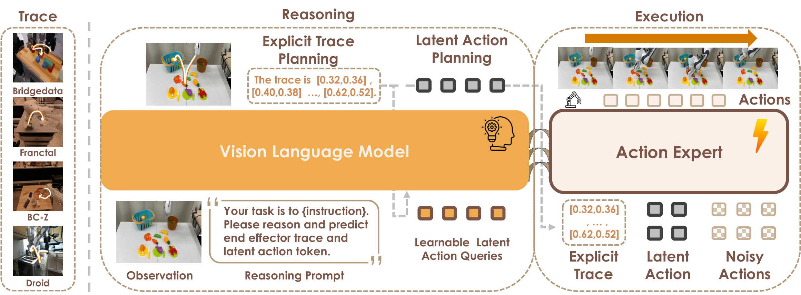

<div align="center">

# 🦾 SemanticVLA

### Towards Semantic Reasoning over Action Memorization via Synergistic Explicit Trace and Latent Action Planning

[](https://cvpr.thecvf.com/virtual/2026/poster/39352)
[](assets/SemanticVLA_CVPR2026.pdf)
[](LICENSE)
[](https://github.com/Fei-Ni/SemanticVLA_Offcial)
[](https://hf.co/collections/spikefly/semanticvla-model-zoo)
[](https://hf.co/collections/spikefly/semanticvla-datasets)

</div>

> ✍️ **Fei Ni**¹, Zhuo Chen², Yifu Yuan³, Zibin Dong³, Xianze Yao³, Shan Luo², Jianye Hao³, Jiankang Deng¹†, Stefanos Zafeiriou¹†<br>
> 🏫 ¹Imperial College London &nbsp;&nbsp; ²King's College London &nbsp;&nbsp; ³Tianjin University<br>
> ✉️ Primary contact: **Fei Ni** ([f.ni@imperial.ac.uk](mailto:f.ni@imperial.ac.uk))

---

> [!NOTE]
> 🎉 **Accepted to [CVPR 2026](https://cvpr.thecvf.com/virtual/2026/poster/39352).** Code, checkpoints, and the trace-annotated TraceX-240K dataset are being released here as the camera-ready lands.

<div align="center">
  
  <br/>
  <sub><b>SemanticVLA overview.</b> A dual-path VLA: <b>explicit trace reasoning</b> (interpretable spatial waypoints) alongside <b>implicit latent action tokens</b> (compact visuomotor primitives), built on our curated <b>TraceX-240K</b> trace-annotated trajectory corpus.</sub>
</div>

## 🔥 Highlights

- 🧠 **Semantic reasoning over action memorization.** A dual-path architecture that produces **explicit trace reasoning** (interpretable spatial waypoints) alongside **implicit latent action tokens** (compact visuomotor primitives) — VLAs that *understand* rather than *memorize*.
- 🚀 **State-of-the-art on standard benchmarks.** Mean success rate **0.982 on LIBERO** (4 suites) and **0.802 on SimplerEnv WidowX** (4 tasks).
- 💪 **Robust under instruction rephrasing.** On LIBERO-Rephrase, where prior VLAs degrade sharply, SemanticVLA maintains stable success rates — closing the gap between direct and reasoning-intensive instructions.
- 📦 **TraceX-240K.** A large-scale trace-annotated trajectory corpus across **BridgeData V2, Fractal (RT-1), BC-Z, and DROID**, released as four LeRobot v3 dataset repositories with dense per-frame end-effector traces.

## 📈 Key Results

<table>
<tr><th colspan="2"> LIBERO (4-suite mean, success rate) </th><th colspan="2"> SimplerEnv (WidowX, success rate) </th></tr>
<tr><td>LIBERO-Spatial</td><td align="right">0.988</td><td>Put Eggplant in Basket</td><td align="right">0.958</td></tr>
<tr><td>LIBERO-Object</td><td align="right">0.996</td><td>Spoon on Towel</td><td align="right">1.000</td></tr>
<tr><td>LIBERO-Goal</td><td align="right">0.974</td><td>Carrot on Plate</td><td align="right">0.792</td></tr>
<tr><td>LIBERO-10</td><td align="right">0.970</td><td>Stack Cube</td><td align="right">0.458</td></tr>
<tr><td><b>Mean</b></td><td align="right"><b>0.982</b></td><td><b>Mean</b></td><td align="right"><b>0.802</b></td></tr>
</table>

## 💡 Method

A Vision-Language Model (**Qwen3-VL-4B-Instruct**) encodes the current observation and language instruction. On top of the VLM, a **DiT-B action expert** (flow-matching) regresses continuous action chunks. We add an auxiliary language-modeling loss that asks the VLM to emit:

1. **Trace tokens** — explicit spatial waypoints describing where the end-effector should move next.
2. **Latent-action tokens** — drawn from a trace-aware codebook learned from short trace + future-action segments.

Both auxiliary heads are supervised entirely in the VLM's language stream and are co-trained with the standard VLA action loss; the action decoder is unmodified. See [`docs/METHOD.md`](docs/METHOD.md) for the full description.

## 🔧 Trace Annotation Pipeline

The pipeline that produced the dense end-effector traces for TraceX-240K lives in [`tools/trace_annotation/`](tools/trace_annotation/):

- **Two-stage VLM pipeline** (Bridge / Fractal / BC-Z): Stage 1 prompts **Molmo-72B** to point at the gripper on 10 fixed keyframes per episode; Stage 2 propagates those keyframes into a per-frame dense trace with **CoTracker** (forward + backward + multi-candidate fusion).
- **Projection pipeline** (DROID): uses DROID's calibrated camera intrinsics/extrinsics + per-frame `cartesian_position` to deterministically project the gripper into each frame.
- **Check tools** ([`tools/trace_annotation/check/`](tools/trace_annotation/check/)): bundle integrity verifier, per-episode raw-frame visualisation, summary stats, single-episode round-trip loader.

## 🤗 Model Zoo

Three checkpoints, each in its own Hugging Face model repository, aggregated by the [Model Zoo collection](https://hf.co/collections/spikefly/semanticvla-model-zoo).

<table>
  <tr>
    <th>Checkpoint</th>
    <th>Backbone</th>
    <th>HF Repository</th>
    <th>Note</th>
  </tr>
  <tr>
    <td><b>SemanticVLA-LAM</b></td>
    <td>DINOv2 ViT-B/14</td>
    <td><a href="https://huggingface.co/spikefly/SemanticVLA-LAM">spikefly/SemanticVLA-LAM</a></td>
    <td>Unified OXE Latent Action Model (Bridge + Fractal + BC-Z), trace-conditioned</td>
  </tr>
  <tr>
    <td><b>SemanticVLA-LIBERO</b></td>
    <td>Qwen3-VL-4B + DiT-B</td>
    <td><a href="https://huggingface.co/spikefly/SemanticVLA-LIBERO">spikefly/SemanticVLA-LIBERO</a></td>
    <td>LIBERO policy, 4-suite mean SR <b>0.982</b></td>
  </tr>
  <tr>
    <td><b>SemanticVLA-SimplerEnv</b></td>
    <td>Qwen3-VL-4B + DiT-B</td>
    <td><a href="https://huggingface.co/spikefly/SemanticVLA-SimplerEnv">spikefly/SemanticVLA-SimplerEnv</a></td>
    <td>SimplerEnv WidowX policy trained on BridgeData V2, mean SR <b>0.802</b></td>
  </tr>
</table>

See [`docs/INFERENCE.md`](docs/INFERENCE.md) for loading and evaluation recipes.

## 🤗 Datasets — TraceX-240K

Trace-annotated LeRobot v3 conversions of four embodiments, aggregated by the [Dataset collection](https://hf.co/collections/spikefly/semanticvla-datasets). Dense end-effector trace coordinates are stored directly in every frame row as `trace.x` / `trace.y`.

<div align="center">
  
  <br/>
  <sub><b>TraceX-240K — dense end-effector trace overlays.</b> Each row is one dataset (<i>top to bottom</i>: <b>BridgeData V2</b>, <b>Fractal / RT-1</b>, <b>BC-Z</b>, <b>DROID</b>); each column is one example episode. The orange progressive trail is the per-frame trace label that SemanticVLA learns to predict.</sub>
</div>

<table>
  <tr><th>Dataset</th><th>Source embodiment</th><th>HF Repository</th></tr>
  <tr><td><b>TraceX · Bridge</b></td><td>BridgeData V2 / WidowX</td><td><a href="https://huggingface.co/datasets/spikefly/SemanticVLA-TraceX-240K-Bridge">spikefly/SemanticVLA-TraceX-240K-Bridge</a></td></tr>
  <tr><td><b>TraceX · Fractal</b></td><td>Fractal / Google Robot (RT-1)</td><td><a href="https://huggingface.co/datasets/spikefly/SemanticVLA-TraceX-240K-Fractal">spikefly/SemanticVLA-TraceX-240K-Fractal</a></td></tr>
  <tr><td><b>TraceX · BC-Z</b></td><td>BC-Z</td><td><a href="https://huggingface.co/datasets/spikefly/SemanticVLA-TraceX-240K-BC-Z">spikefly/SemanticVLA-TraceX-240K-BC-Z</a></td></tr>
  <tr><td><b>TraceX · DROID</b></td><td>DROID / Franka</td><td><a href="https://huggingface.co/datasets/spikefly/SemanticVLA-TraceX-240K-DROID">spikefly/SemanticVLA-TraceX-240K-DROID</a></td></tr>
</table>

See [`docs/DATASETS.md`](docs/DATASETS.md) for the schema and loader examples, and [`tools/visualize/`](tools/visualize/) for the script that renders the trace overlays shown above.

## 🎮 Getting Started

```bash
# 1. Clone
git clone https://github.com/Fei-Ni/SemanticVLA_Offcial.git
cd SemanticVLA_Offcial

# 2a. (optional) Latent Action Model
huggingface-cli download spikefly/SemanticVLA-LAM      --local-dir ./SemanticVLA-LAM

# 2b. LIBERO policy
huggingface-cli download spikefly/SemanticVLA-LIBERO   --local-dir ./SemanticVLA-LIBERO

# 2c. SimplerEnv WidowX policy
huggingface-cli download spikefly/SemanticVLA-SimplerEnv --local-dir ./SemanticVLA-SimplerEnv
```

Loading a VLA policy is one line — both LIBERO and SimplerEnv checkpoints share the same loader:

```python
from semanticvla.model.framework.base_framework import baseframework
policy = baseframework.from_pretrained("./SemanticVLA-LIBERO/pytorch_model.pt")
policy.eval()
```

Full inference and training recipes live in [`docs/INFERENCE.md`](docs/INFERENCE.md) and [`docs/TRAINING.md`](docs/TRAINING.md).

## 🦾 Real-Robot Deployment

For real-robot serving (Arx5 reference example bundled with the repo), see [`examples/REAL/arx/README.md`](examples/REAL/arx/README.md). The same `server_policy` interface used by SimplerEnv evaluations applies on real hardware via a WebSocket bridge.

## 🙏 Acknowledgements

This work builds on several excellent open-source projects:

- [**StarVLA**](https://github.com/StarVLA) — provides the Qwen-VL + DiT action backbone implementation that we use as the foundation of our model.
- [**UniVLA**](https://github.com/OpenDriveLab/UniVLA) — the latent-action token formulation that motivates our trace-conditioned LAM.
- [**Molmo**](https://huggingface.co/allenai/Molmo-72B-0924) — open VLM used in Stage 1 of the trace annotation pipeline (sparse gripper keyframes).
- [**CoTracker**](https://github.com/facebookresearch/co-tracker) — dense point tracker used in Stage 2 of the trace annotation pipeline (keyframe → per-frame propagation).
- [**LeRobot**](https://github.com/huggingface/lerobot) — the v3 chunked Parquet/video data format used by all four released datasets.
- [**SimplerEnv**](https://github.com/simpler-env/SimplerEnv) and [**LIBERO**](https://github.com/Lifelong-Robot-Learning/LIBERO) — the simulation benchmarks used for evaluation.

## ✏️ Citation

If you find SemanticVLA useful for your research, please consider citing:

```bibtex
@inproceedings{ni2026semanticvla,
  title     = {SemanticVLA: Towards Semantic Reasoning over Action Memorization via Synergistic Explicit Trace and Latent Action Planning},
  author    = {Ni, Fei and Chen, Zhuo and Yuan, Yifu and Dong, Zibin and Yao, Xianze and Luo, Shan and Hao, Jianye and Deng, Jiankang and Zafeiriou, Stefanos},
  booktitle = {Proceedings of the IEEE/CVF Conference on Computer Vision and Pattern Recognition (CVPR)},
  year      = {2026}
}
```

## 📜 License

Released under the [MIT License](LICENSE).
